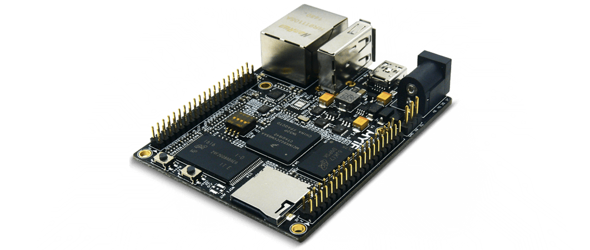
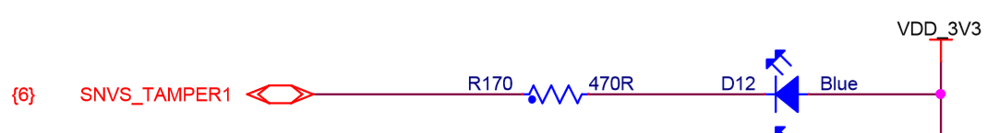
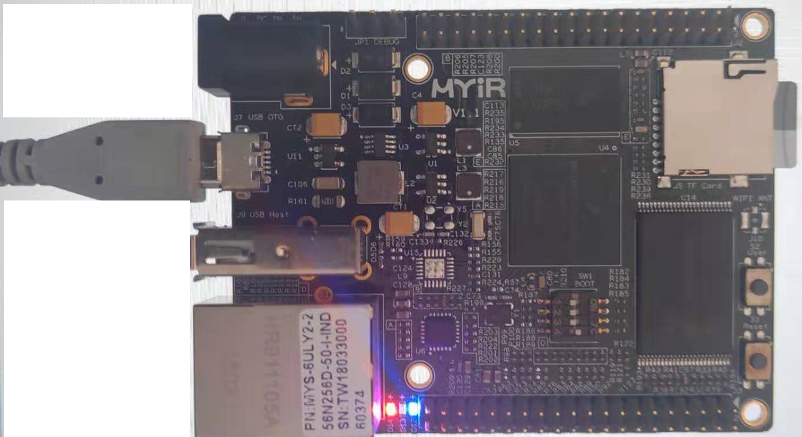

# ygOS说明

ygOS是一款宏内核设计的简约的操作系统,包含任务管理, 任务通信, 设备管理,文件管理，内存管理五大模块，整个代码低于2000行

# 硬件平台

## 所有支持硬件平台
```
linux simulator  
mdk simulator     
stm32f4discovery 
qemu-lm3s6965evb
qemu-vexpress-a9  
stm32f1     
mys-6ull
qemu-mcimx6ul-evk
```

## 推荐qemu-lm3s6965evb平台测试
```
cd src/board/qemu-lm3s6965evb
make run
```

## 推荐qemu-qemu-vexpress-a9 平台测试cortex-a9
```
cd src/board/qemu-vexpress-a9 
make run
```

## 推荐mys-6ull 平台测试cortex-a7 528Mhz主频
### 简介

本单板是基于米尔科技的MYS-6UY2-256N256D-50-I-IND

MYS-6ULX-IOT 是米尔科技推出的基于NXP公司 I.MX6ULL 系列处理器的面向物联网
市场推出的单板计算机。I.MX6ULL 是一个高功效、高性价比的应用处理器系列，采用单个
ARM Cortex-A7 内核，运行速度高达 528 MHz。该 系列的每个处理器提供多种存储器接口，
其中包括 16 位 LPDDR2、DDR3、DDR3L、NAND Flash、NOR Flash、eMMC、Quad SPI
和各种其他接口，用于连接外围设备



### imx-6ull的LED管脚
低电平点亮LED, 高电平关闭LED,



###  构建过程
烧写固件到sd卡
```
$ make 
$ ./download /dev/sdb 
```


      
# 功能说明
- 线程管理最多支持32个线程
- 线程调度是完全基于线程优先级的抢占式调度
- 支持线程主动休眠
- 支持线程同步通信对象：信号量
- 支持基于内存池的内存管理malloc和free
- 支持FAT32文件系统
- 整个内核代码不到2000行
- 支持VFS文件系统
- 支持proc虚拟文件系统
- 支持基于二叉树的驱动设备管理
- 支持信号异步通信
- 支持cortex-M3, cortex-M4, cortex-A9, cortex-A7架构
# 构建

## linux平台
```sh
# git clone https://github.com/yangang123/ygOS.git
# cd ygOS && make build && cd build
# cmake ../
# make 
```


# 目录树
```
yangang@ubuntu:~/work/ygOS$
.
├── app
│   ├── platform
│   └── ygsh
├── CMakeLists.txt
├── doc
│   ├── device_manage.md
│   ├── file_manage.md
│   ├── memory_manage.md
│   ├── resource
│   ├── task_ipc.md
│   └── task_manage.md
├── project
│   ├── project-mdk-sim
│   └── project-stm32f4discovery
├── README.md
├── ReleaseNote.md
└── src
    ├── arch
    │   ├── arm
    │   └── linux
    ├── board
    │   ├── mdk_sim
    │   ├── mys-6ull
    │   ├── qemu-lm3s6965evb
    │   ├── qemu-mcimx6ul-evk
    │   ├── qemu-vexpress-a9
    │   ├── stm32f1
    │   └── stm32f4_discovery
    ├── driver
    │   └── ramlog.c
    ├── fs
    │   ├── deviceNode
    │   ├── fatfs
    │   ├── fs_driver.c
    │   ├── fs_mount.c
    │   ├── fs_syscall.c
    │   └── procfs
    ├── include
    │   └── ygos
    ├── ipc
    │   └── sem.c
    ├── kernel
    │   ├── core.c
    │   ├── idle.c
    │   ├── signal.c
    │   └── sleep.c
    └── mm
        └── malloc.c

18 directories, 4 files
```


